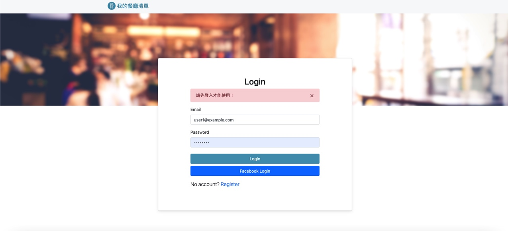

# Introduction

學期S3 A1作業：餐廳清單擴充Login功能 + 重構餐廳清單


# Screenshot



# Features
* 運用第三方工具來強化 app 的功能
* 使用 Passport 打造註冊功能
* 串接 Facebook 第三方登入
* 使用 bcrypt 保護使用者的密碼
* 能打造「使用者認證」的基本體驗，包括動線、邏輯、資料設計以及例外處理

# Installation
### 1. Ensure you have already installed node.js and npm on your device
### 2. Open terminal and clone the files to your local server
```
git clone https://github.com/Kaminoikari/restaurant_list_CRUD.git
```
### 3. Initating and install all necessary external packages
```
cd S3A1_restaurant_list
npm install
```
### 4. Set up seed data with MongoDB
```
npm run seed

```
### 5. Executing the project
```
node app.js
or
nodemon app.js // if you have installed nodemon from npm
```

### 6. Click below link in the browser to see the result
http://localhost:3000

### 6. Use ```Cmd(⌘)+C``` in the terminal if you wish to terminate the project

# Requirement
* Node.js v16.14.0
* Express 4.16.4
* Express-handlebars 3.0.0
* Express-session 1.17.1
* Mongoose 5.9.7
* Passport 0.4.1
* Passport-local 1.0.0
* Passport-facebook 3.0.0
* Bootstrap 4.3.1
* Font-awesome 5.8.1
* dotenv 8.2.0
* connect-flash 0.1.1
* Bcrpyt.js 2.4.3
* Body-parser 1.19.2